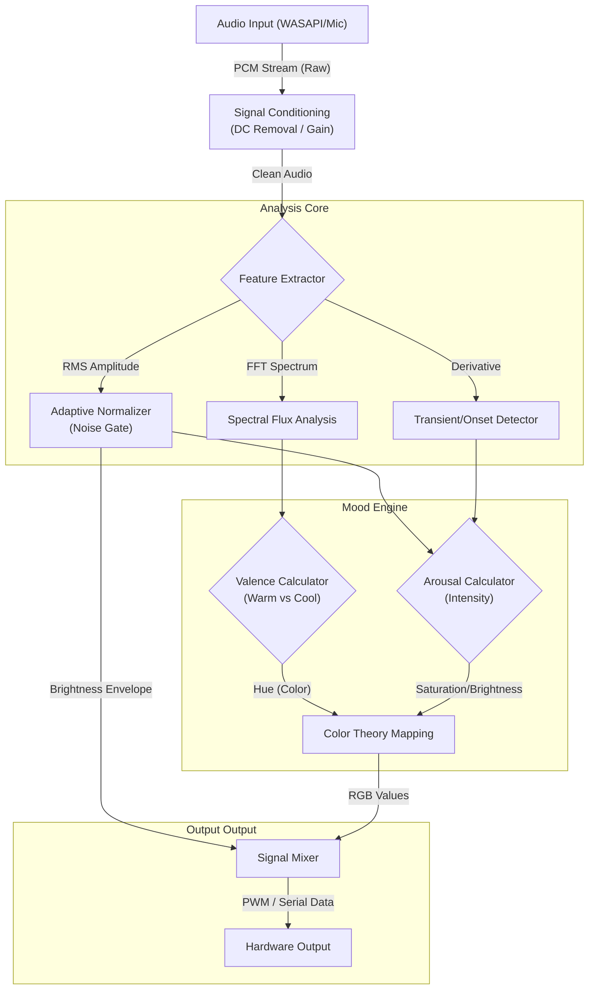

# Music Reactive Lighting Engine 🎵💡

### *A High-Frequency Audio-Visual Intelligence System*

**Music Reactive Lighting** is a sophisticated Python-based engine designed to translate musical audio into immersive, real-time lighting effects. Unlike traditional "sound-activated" lights that rely solely on volume thresholds, this system implements a **psychoacoustic emotional analysis pipeline**. It decomposes audio signals into **Valence** (Mood) and **Arousal** (Energy) components, creating a lighting experience that mirrors the emotional arc of the music.

Designed for scalability, the engine supports standard PC loopback (WASAPI) and is optimized for embedded deployment (Raspberry Pi/ESP32).

---

## 🏗 Architecture

The system follows a modular pipeline architecture, processing raw PCM audio into lighting control signals through three distinct stages: **Signal Conditioning**, **Feature Extraction**, and **Affective Mapping**.



---

## 🔥 Key Technical Features

### 1. Psychoacoustic Mood Engine (Valence-Arousal Model)
The core intelligence relies on **Russell's Circumplex Model of Affect**, mapping audio features to coordinates in a 2D emotional plane.
-   **Arousal (Energy)**: Calculated via **RMS Loudness** combined with **Onset Strength**. Fast transients (drums) and high amplitude drive the system towards high intensity and saturation.
-   **Valence (Emotion)**: Derived from **Spectral Harmony Analysis**.
    -   *Warm/Positive*: High spectral dominance in Mid/High bands (Vocals, Guitars) maps to warm hues (Orange, Red, Pink).
    -   *Cool/Negative*: Low-frequency dominance (Sub-bass, Drone) maps to cool hues (Blue, Cyan, Indigo).
    -   **Hybrid Valence Algorithm**: Uses a weighted average of **Absolute Spectral Anchor** (Genre classification) and **Adaptive Deviation** (Phrasing relative to the song's average) to ensure dynamic responsiveness across genres.

### 2. Adaptive Noise Cancellation (Auto-Calibration) 🧠
To ensure hardware independence, the system implements a robust **Adaptive Noise Gate**:
-   **Startup Calibration**: On initialization, the system buffers 2000ms of audio to analyze the noise profile of the input device.
-   **Dynamic Thresholding**: A hysteresis gate is configured specifically using the measured noise floor (`Noise_RMS + 10% Headroom`).
-   **Result**: Ensures a "True Black" state during silence, eliminating the "blue flicker" artifact common on noisy hardware inputs (e.g., analog aux lines).

### 3. Advanced Rhythmic Dynamics
-   **Hybrid Onset Detection**: Combines **Spectral Flux** (high-frequency change) with **RMS Amplitude** (low-frequency impact) to accurately detect both sharp snares and deep kicks.
-   **Cinematic Decay**: Brightness envelope follows a non-linear decay curve, simulating the thermal persistence of incandescent filaments for a fluid, non-strobing effect.
-   **Transient Inter-Frame Punch**: Drastically increases brightness headroom during transient events for maximum visual impact.

---

## 🧮 Core Logic & Formulas

### Valence (Mood) Calculation
Valence $V$ is computed to determine the "temperature" of the track:

$$ V = (0.4 \cdot V_{absolute}) + (0.6 \cdot V_{adaptive}) $$

Where:
-   $V_{absolute}$ represents the instant spectral balance (Treble vs Bass).
-   $V_{adaptive}$ represents the deviation from the rolling average spectral centroid.

### Arousal (Energy) Mapping
Arousal $A$ drives the color saturation and overall intensity:

$$ A = \frac{Loudness_{norm} + (Onset_{strength} \cdot 2.0)}{3.0} $$

---

## 🚀 Installation & Usage

### Prerequisites
-   Python 3.10+
-   `portaudio` (via `pip install pyaudio`)

### Setup
1.  **Clone the Repository**:
    ```bash
    git clone https://github.com/your-username/music-reactive-lighting.git
    cd music-reactive-lighting
    ```

2.  **Install Dependencies**:
    ```bash
    pip install -r requirements.txt
    ```

### Execution
**Standard Mode (Live Audio)**
Run the system with the visual debugger to verify signal processing:
```bash
python -m app.main --live --gui
```
*Note: The system will calibrate for 2 seconds upon start. Please ensure silence during this window.*

**Headless Mode (Deployment)**
For embedded systems (e.g., Raspberry Pi):
```bash
python -m app.main --live
```

---

## 🔧 Developer Tools

The functionality relies on precise calibration. The `tools/` directory contains utility scripts:
-   `measure_noise.py`: Quantifies the SNR (Signal-to-Noise Ratio) of the input device.
-   `record_samples.py`: Captures raw PCM data for offline debugging.
-   `analyze_track.py`: Generates CSV telemetry of modulation sources for algorithmic tuning.

---

*Developed for the Advanced Agentic Coding Project.*
