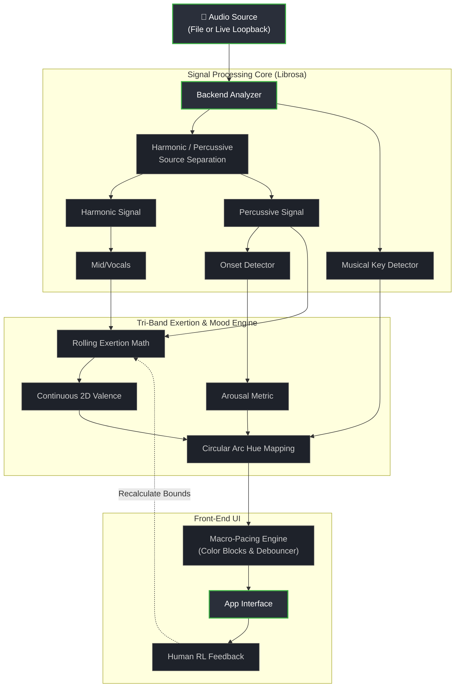

# Music Reactive Lighting 🎵💡

A high-performance, intelligent audio reactive engine that translates music into real-time, emotionally accurate colors and concert-grade lighting. 

Unlike basic visualizers that simply map volume to brightness or bass to red, this project implements a sophisticated **Music Information Retrieval (MIR)** pipeline. It utilizes a **Psychoacoustic Tri-Band Exertion Algorithm**, **Harmonic-Percussive Source Separation (HPSS)**, and a **Persistent Neural Memory bank** to understand the *emotion* (Valence), *energy* (Arousal), and *groove* of a track in the exact same way a professional Concert Light Jockey does.

 *(UI Preview)*

---

## 🌟 The Philosophy: Beyond "Sound Activated"

By analyzing historical frequency tracking, musical key extraction, and implementing professional macro-pacing rules (like *Chris Kuroda's* "Color Blocks" and *Tobias Rylander's* "Strobe Blanking"), the system naturally understands how to light a dark, heavy trap track versus a warm, bright acoustic ballad without relying on artificial randomness or muddy transitions.

### 1. Psychoacoustic Tri-Band Exertion & HPSS
The system uses the `librosa` library to split audio into **Harmonic** (Vocals, Synths, Melody) and **Percussive** (Drums, Clicks) signals. 
- **Exertion Math**: Instead of raw decibels, the engine tracks the *rolling average* of each frequency band independently, calculating an "Exertion" score (`current_energy / average_energy`). 
- **Valence (Mood)**: If Harmonic Mids/Highs are exerting harder than the Bass relative to the track's history, the engine considers the mood "Warm" or "Happy". If Bass exerts harder, it shifts toward Cool/Deep colors.

### 2. Continuous 2D Circular Hue Mapping
Russell's Circumplex Model of Emotion maps Arousal and Valence onto a 2D plane. 
- The engine uses a fully continuous mathematical arc to map these emotional coordinates to a 360-degree Hue wheel. 
- **Circular Smoothing**: Transitions utilize a custom `CircularExponentialMovingAverage` algorithm. Going from Orange (0.1) to Magenta (0.9) mathematically crosses Red (0.0) instead of dragging backward through Cyan (0.5), preventing muddy visual artifacts.
- **Key-Based Hue Shifting**: The system playfully subtle shifts the root hue based on the Krumhansl-Schmuckler Musical Key extraction (e.g., C Major, F# Minor). Minor keys are slightly inverted so they feel cooler.

### 3. Professional Macro-Pacing (Trap Physics)
To prevent visual fatigue during chaotic genres, the render loop enforces strict concert lighting rules:
- **Color Block Inertia**: During "Hype Drops" (Arousal > 0.70), the palette inertia locks to 95%. This prevents the wash color from violently flickering between Red (808 Bass) and Cyan (Trap Hi-Hats) during dense mixes.
- **Strobe Debouncing (Blanking)**: "Light is nothing without darkness." The UI enforces a strict 120ms cooldown whenever a massive Kick or Snare triggers a blinding white bloom. This crushes rapid 16th-note hi-hat flashes, ensuring strobes map to the *groove* rather than glitching on high-frequencies.

### 4. Neural Memory Bank & RL Feedback UI 🧠
The system doesn't just react; it learns human emotion.
- The player UI includes a **Human Sentiment Panel** where users submit how the song feels.
- The `SongMemoryBank` digests the rolling 20-track history to update an ML `global_model.json`, dynamically recalculating the engine's center-of-gravity (Dominance Anchors, Valence Multipliers) based on the user's specific music taste.

---

## 🏗 Architecture & Pipeline


```mermaid
graph TD
    classDef main fill:#2a2f3a,stroke:#3bb143,stroke-width:2px,color:#fff;
    classDef sub fill:#1e222a,stroke:#555,stroke-width:1px,color:#ccc;
    
    AudioSource["🎵 Audio Source<br/>(File or Live Loopback)"]:::main --> Analyzer["Backend Analyzer"]:::main
    
    subgraph "Signal Processing Core (Librosa)"
        Analyzer --> HPSS["Harmonic / Percussive<br/>Source Separation"]:::sub
        HPSS --> Harmonic["Harmonic Signal"]:::sub
        HPSS --> Percussive["Percussive Signal"]:::sub
        
        Harmonic --> Mids["Mid/Vocals"]:::sub
        Percussive --> Transients["Onset Detector"]:::sub
        Analyzer --> Key["Musical Key Detector"]:::sub
    end
    
    subgraph "Tri-Band Exertion & Mood Engine"
        Mids --> Exertion["Rolling Exertion Math"]:::sub
        Percussive --> Exertion
        Exertion --> Valence["Continuous 2D Valence"]:::sub
        Transients --> Arousal["Arousal Metric"]:::sub
        
        Valence --> Color["Circular Arc Hue Mapping"]:::sub
        Arousal --> Color
        Key --> Color
    end
    
    subgraph "Front-End UI"
        Color --> Pacing["Macro-Pacing Engine<br/>(Color Blocks & Debouncer)"]:::sub
        Pacing --> PlayerUI["App Interface"]:::main
        
        PlayerUI --> Feedback["Human RL Feedback"]:::sub
        Feedback -.->|"Recalculate Bounds"| Exertion
    end
```

---

## 🚀 Installation & Usage

### Prerequisites
- Python 3.12+ (Windows recommended for WASAPI loopback)

### Setup
1. **Clone the Repository**:
    ```bash
    git clone https://github.com/CanYuzbey/music-reactive-lighting.git
    cd music-reactive-lighting
    ```

2. **Install Dependencies**:
    Dependencies include `pygame`, `customtkinter`, `librosa`, and `pyaudiowpatch` for live audio routing.
    ```bash
    pip install -r requirements.txt
    ```

### Playback Options

The project includes two different clients depending on your needs.

#### 1. Live System Audio Sync (Spotify/Gaming)
Captures your desktop's system audio ("What U Hear") in real-time via WASAPI loopback, calculating the lighting matrices on live 40ms rolling windows.
```bash
python -m app.ui.live_player
```
*Click **Start Live Sync** to begin listening to your speakers.*

#### 2. Local File Analyzer (Perfect AOT Sync)
Reads local `.mp3` or `.wav` files and crunches the entire computational load Ahead-of-Time (AOT), storing it in memory for flawless 60fps PyGame playback without CPU spikes.
```bash
python -m app.ui.modern_player
```

