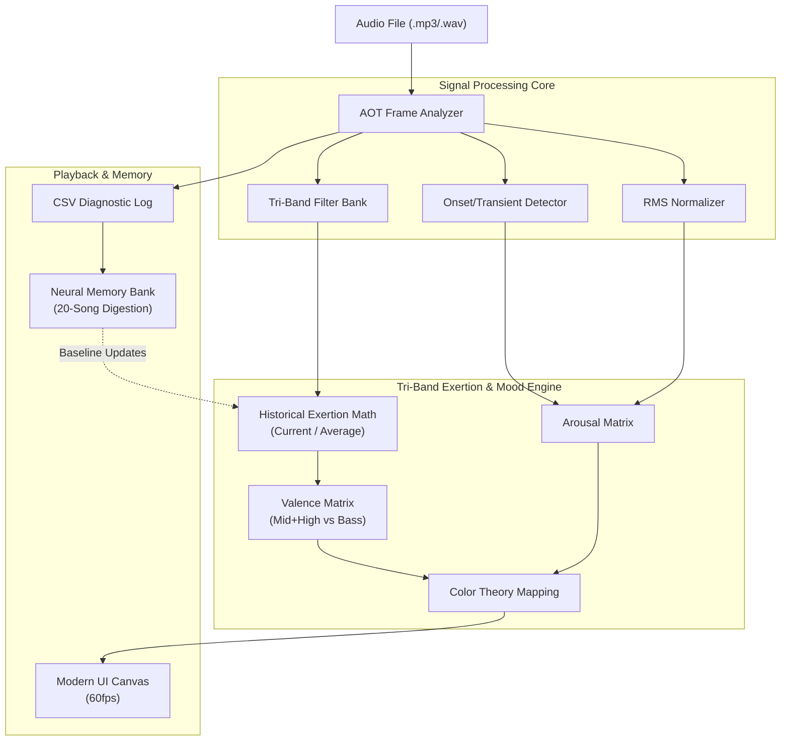

# Music Reactive Lighting 🎵💡

A high-performance, intelligent desktop audio player that translates music into real-time, emotionally accurate colors and lighting using a **Psychoacoustic Tri-Band Exertion Algorithm** and **Persistent Neural Memory**.

 *(UI Preview)*

## 🌟 The Philosophy: Beyond "Sound Activated"
Most music visualizers and "sound-activated" LEDs simply map volume to brightness or bass to red. This project implements a sophisticated **Music Information Retrieval (MIR)** pipeline designed to understand the *emotion* (Valence) and *energy* (Arousal) of a track.

Instead of raw frequency amplitude, the engine tracks **Historical Tri-Band Exertion**. It learns how hard the Bass, Mids, and Highs are *working relative to their own baselines*. When a soulful acapella plays, the system knows to map it to Warm/Bright colors, even if the sub-bass is mathematically louder in the background.

## 🔥 Key Technical Features

### 1. Psychoacoustic Tri-Band Mood Engine
The system decomposes audio into Low, Mid, and High bands, continuously tracking their rolling averages.
- **Valence (Mood)**: If Mid/High frequencies are "exerting" harder than the Bass relative to the track's history, the engine shifts toward Warm/Positive colors (Yellow/Orange/Cyan). If the Bass is exerting harder, it shifts toward Cool/Deep colors (Blue/Purple/Red).
- **Arousal (Energy)**: Driven by the Peak Exertion across any band combined with transient Onset detection. Fast transients (drums) and high amplitude drive the system towards high intensity and saturation.

### 2. The Persistent "Neural Memory" Bank 🧠
The system doesn't just react; it learns your music taste.
- Every time a song is analyzed, its exact mathematical breakdown (average bass exertion, typical mood) is logged.
- The 20-Song Rolling Memory Bank continuously digests this history to build a `global_model.json`.
- When you play a new song, the `MoodEngine` initializes with these learned baselines. If your playlist is extremely bass-heavy, the system stops letting the bass wash out the colors and adapts its expectations!

### 3. Ahead-of-Time (AOT) Desktop Player UI
Built with `customtkinter` and `pygame`:
- **Flawless 60FPS Sync**: Analyzes the entire audio file *before* playback. PyGame is locked to a 512-sample buffer at 44.1kHz, guaranteeing zero-latency visual synchronization.
- **Real-Time Dashboard**: Displays live BPM, Arousal, Valence, and calculated Hex Color.

---

## 🏗 Architecture & Pipeline


```mermaid
graph TD
    AudioFile["Audio File (.mp3/.wav)"] --> AOTAnalyzer["AOT Frame Analyzer"]
    
    subgraph Signal Processing Core
        AOTAnalyzer --> BandSplit["Tri-Band Filter Bank"]
        AOTAnalyzer --> Transients["Onset/Transient Detector"]
        AOTAnalyzer --> Loudness["RMS Normalizer"]
    end
    
    subgraph Tri-Band Exertion & Mood Engine
        BandSplit --> Exertion["Historical Exertion Math<br/>(Current / Average)"]
        Exertion --> Valence["Valence Matrix<br/>(Mid+High vs Bass)"]
        Transients --> Arousal["Arousal Matrix"]
        Loudness --> Arousal
        
        Valence --> Color["Color Theory Mapping"]
        Arousal --> Color
    end
    
    subgraph Playback & Memory
        Color --> PlayerUI["Modern UI Canvas<br/>(60fps)"]
        AOTAnalyzer --> LogDump["CSV Diagnostic Log"]
        LogDump --> MemoryBank["Neural Memory Bank<br/>(20-Song Digestion)"]
        MemoryBank -.->|"Baseline Updates"| Exertion
    end
```

---

## 🚀 Installation & Usage

### Prerequisites
- Python 3.10+
- `librosa`, `pygame`, `customtkinter`, `numpy`

### Setup
1. **Clone the Repository**:
    ```bash
    git clone https://github.com/CanYuzbey/music-reactive-lighting.git
    cd music-reactive-lighting
    ```

2. **Install Dependencies**:
    ```bash
    pip install -r requirements.txt
    ```

3. **Run the Desktop Player**:
    ```bash
    python -m app.ui.modern_player
    ```

---

## 🔮 Project Roadmap & Status

### ✅ Phase 1 & 2: Core Intelligence & Live Audio
- Built the real-time DSP core (`MoodEngine`, `DynamicsController`).
- Implemented Adaptive Normalization (Auto-Calibration).

### ✅ Phase 3: Desktop UI Transition
- Pivoted to an Ahead-of-Time Desktop MP3 Player.
- Built Dark Mode UI with real-time stats dashboard.
- Fixed PyGame audio synchronization latency.

### ✅ Phase 4 & 5: Tri-Band Normalization & Diagnostics
- Implemented state-of-the-art independent band exertion logic.
- Built a CSV logging system to prove mathematical accuracy against edge-case test tracks.

### ✅ Phase 6: Machine Memory
- Added `SongMemoryBank` to continuously learn from the user's 20-track listening history to adapt the visual baselines.

### � Phase 7: Hardware Output (Future)
- Connect the calculated AOT frame arrays to a live Serial/WLED output for physical LED strip execution.

---
*Developed for the Advanced Agentic Coding Project.*
